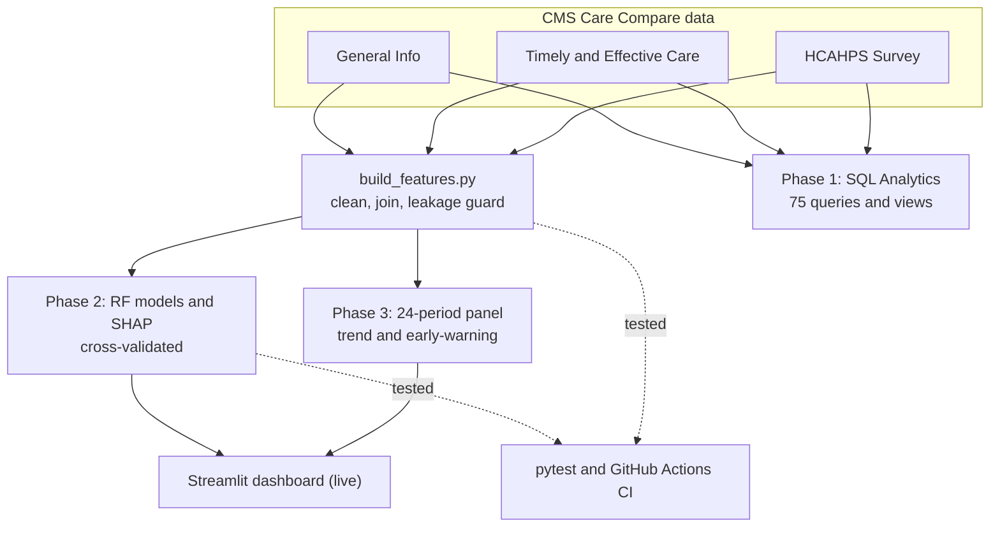
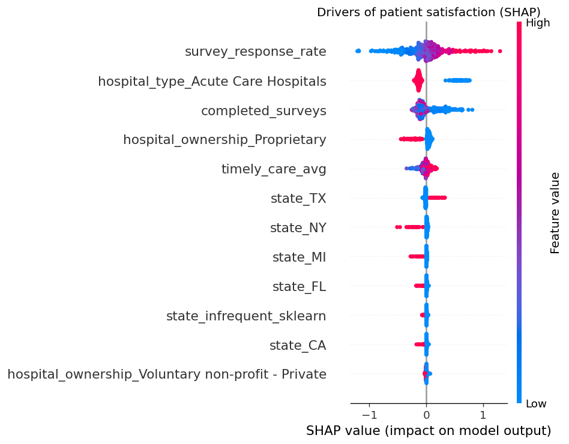
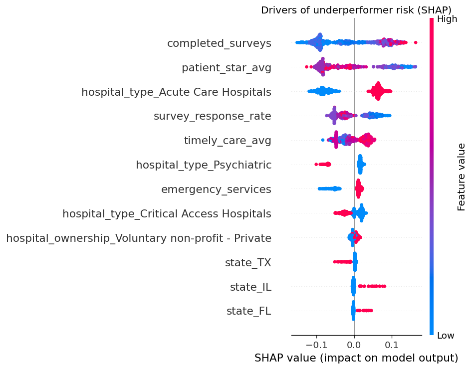
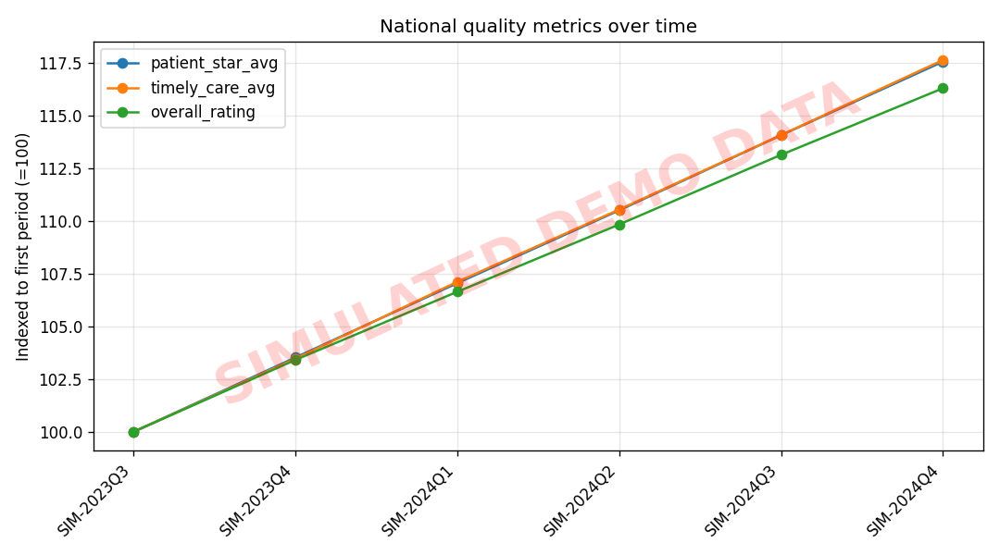

<h1 align="center">🏥 Hospital Quality Intelligence</h1>

<p align="center">
  <em>An end-to-end analytics project on 5,400+ U.S. hospitals — from SQL exploration to explainable ML to a deployed decision-support dashboard.</em>
</p>

<p align="center">
  <a href="https://hospital-quality-intelligence-puoehkx7u7po2laff5rv6y.streamlit.app/"></a>
  <a href="https://github.com/jumma786/hospital-quality-intelligence/actions/workflows/ci.yml"></a>
  
  
  
  
  
  
</p>

<p align="center">
  <a href="https://hospital-quality-intelligence-puoehkx7u7po2laff5rv6y.streamlit.app/">
    
  </a>
</p>

<p align="center">
  <sub><em>Hosted on Streamlit Community Cloud (free tier) — if it shows a sleep screen, click “Yes, get this app back up!” and it wakes in ~30 seconds.</em></sub>
</p>

---

## Overview

**Hospital Quality Intelligence** analyzes public **CMS Care Compare** data to help answer a question a real state health department faces: *which hospitals are underperforming, why, and where should limited oversight resources go?*

The project is built in three phases that mirror how a real analytics product matures:

| Phase | Question | Deliverable |
|:-----:|----------|-------------|
| **1 · SQL Analytics** | *What does the data say?* | 75 analytical queries across 5 perspectives |
| **2 · Machine Learning** | *What should we do about it?* | 2 explainable models + an interactive dashboard |
| **3 · Longitudinal Pipeline** | *Where are things heading?* | Early-warning trend analysis over time |

### Results at a glance

- 📊 **5,432 hospitals** analyzed from 3 CMS datasets
- 🗄️ **75 SQL queries** — JOINs, CTEs, window functions, reusable views
- 🤖 **Patient-satisfaction model** — Random Forest, **R² = 0.44**
- 🎯 **Underperformer-triage model** — Random Forest, **ROC-AUC = 0.90** (84% recall)
- 🔍 **SHAP explainability** + 5-fold cross-validated model selection
- 📈 **24 quarterly CMS releases (2021–2026)** stitched into a longitudinal panel → **817 hospitals** flagged on a declining trajectory
- ✅ **13 automated tests** + **GitHub Actions CI** enforcing a strict data-leakage guard

### Architecture



---

## Table of Contents

- [Tech Stack](#tech-stack)
- [Dashboard Preview](#dashboard-preview)
- [Phase 1 — SQL Analytics](#phase-1--sql-analytics)
- [Phase 2 — Machine Learning](#phase-2--machine-learning)
- [Phase 3 — Longitudinal Pipeline](#phase-3--longitudinal-pipeline)
- [Testing & CI](#testing--ci)
- [Repository Structure](#repository-structure)
- [Getting Started](#getting-started)
- [Limitations](#limitations)
- [Data Source & Attribution](#data-source--attribution)

---

## Tech Stack

| Layer | Tools |
|-------|-------|
| **Data & SQL** | Microsoft SQL Server (T-SQL), SSMS / SQLEXPRESS, PowerShell (bulk import) |
| **ML & Analysis** | Python, pandas, scikit-learn, SHAP, XGBoost |
| **App** | Streamlit |
| **Quality** | pytest, GitHub Actions (CI on Python 3.10 & 3.11) |

---

## Dashboard Preview

**▶ [Launch the live app](https://hospital-quality-intelligence-puoehkx7u7po2laff5rv6y.streamlit.app/)** — a three-tab decision-support tool built for a hospital-quality oversight official:

| Tab | What it does |
|-----|--------------|
| 🎯 **Audit Triage** | *"Where should oversight resources go first?"* — a ranked, filterable risk list. Pick a state and the top-N highest-risk hospitals surface instantly (model-scored risk, CMS rating, and patient stars side by side). |
| 🔍 **Hospital Profile** | Single-hospital drill-down — predicted risk, satisfaction, national rank, and the structural profile behind the score. |
| 📋 **Model Card** | Full transparency — metrics, the leakage-free training design, embedded SHAP driver plots, and honest limitations. |

> _Tip: to embed a screenshot here, drop a PNG at `docs/assets/dashboard.png` and reference it — the app's Audit Triage tab makes the strongest hero image._

---

## Phase 1 — SQL Analytics

Seventy-five queries answer real business questions across five analytical perspectives, each graded **Easy → Medium → Difficult**.

### Dataset

Public data from the Centers for Medicare & Medicaid Services (CMS) — *Hospital Care Compare* ([data.cms.gov](https://data.cms.gov/provider-data/)):

| Table | Source file | Description |
|-------|-------------|-------------|
| `hospital_general_info` | `Hospital_General_Information.csv` | One row per hospital — location, type, ownership, emergency services, overall star rating, mortality/safety/readmission measure counts |
| `timely_effective_care` | `Timely_and_Effective_Care-Hospital.csv` | Process-of-care measure scores by clinical condition |
| `hcahps_survey` | `HCAHPS-Hospital.csv` | HCAHPS patient-experience survey results (star ratings, response rates, completed surveys) |

> **Note:** Raw CSVs (~140 MB) are not committed (one exceeds GitHub's 100 MB limit). Download them from CMS and place them in `data/` before importing.

### The five perspectives

1. **Geographic** — Where are the clusters of low-rated hospitals? *(counts & averages by state/county, state rankings, worst-hospital-per-state)*
2. **Ownership & Facility Type** — How do outcomes differ by who runs the hospital? *(for-profit vs. non-profit, critical access, per-type leaders)*
3. **Clinical Quality & Safety** — Mortality, safety, and readmission outcomes combined into a **composite risk score** and national ranking
4. **Timeliness & Effective Care** — Process-of-care scores by condition, joined to hospital info, with period-over-period analysis (`LAG`)
5. **Patient Experience** — HCAHPS survey signals, and whether **higher-risk hospitals also have lower patient satisfaction**

> The capstone query (**Q75**) unifies all three sources into a single **national hospital scorecard**, blending risk, timeliness, and satisfaction into one ranked score.

### Techniques demonstrated

`GROUP BY` / `HAVING` aggregation · safe type handling on messy data (`TRY_CAST`, `ISNULL`, `Not Available` guards) · `CASE`-based conditional aggregation · multi-table **JOINs** on `facility_id` · single- and multi-**CTE** pipelines · **window functions** (`RANK`, `ROW_NUMBER`, `NTILE`, `LAG` with `PARTITION BY`) · correlated & scalar **subqueries** · reusable **views**.

---

## Phase 2 — Machine Learning

Two explainable models turn the analysis into a decision-support product, in [`ml/`](ml/).

### Business problems solved

| Stakeholder | Problem | How the model helps |
|-------------|---------|---------------------|
| Regulator / health dept. | Limited audit capacity | **Ranked risk list** — inspect the highest-risk hospitals first |
| Hospital administrator | *What do we fix?* | **SHAP** shows which controllable factors drive lower satisfaction |
| Insurer / payer | Network benchmarking | Predicted-vs-actual flags peer over/under-performers |

### The two models

| Model | Task | Target | Test performance |
|-------|------|--------|:----------------:|
| **Patient-satisfaction** | Regression (Random Forest) | Avg HCAHPS star rating | **R² = 0.44** · MAE = 0.47★ |
| **Underperformer flag** | Classification (Random Forest) | Low-rated / worse-than-average hospital | **ROC-AUC = 0.90** · recall = 0.84 |

### ⚠️ Leakage discipline — the key design decision

The CMS overall rating is *mechanically derived* from the mortality/safety/readmission counts, so predicting it from those counts yields a fake "perfect" model. Instead, both models train on **structural + patient-experience + process features only** (type, ownership, location, emergency services, survey engagement, timely-care scores). The result is a lower — but **honest and interpretable** — model. Forbidden columns live in one place (`config.LEAKAGE_COLS`) and **a unit test asserts they can never reach the feature matrix.**

### Model selection — 5-fold cross-validated

Every candidate must beat a trivial baseline (`python src/compare_models.py`):

| Task | Metric | Baseline | Ridge / LogReg | HistGB | RandomForest | XGBoost |
|------|:------:|:--------:|:--------------:|:------:|:------------:|:-------:|
| Satisfaction (regression) | R² | −0.07 | 0.36 | 0.39 | 0.39 | **0.40** |
| Underperformer (classification) | ROC-AUC | 0.50 | 0.72 | 0.72 | **0.83** | 0.74 |

*Random Forest ships for its top classification AUC and stable regression score; XGBoost edges it slightly on R².*

### Explainability (SHAP)

| Drivers of patient satisfaction | Drivers of underperformer risk |
|:---:|:---:|
|  |  |

### Interactive dashboard

A Streamlit app with three tabs: **Audit Triage** (ranked risk list by state), **Hospital Profile** (single-hospital drill-down), and **Model Card** (metrics + honest limitations).

```bash
cd ml && pip install -r requirements.txt
python src/build_features.py     # 3 CSVs -> one per-hospital feature table
python src/compare_models.py     # 5-fold CV leaderboard vs. baselines
python src/train_models.py       # trains models + SHAP plots + scored list
streamlit run app.py             # launch the dashboard
```

---

## Phase 3 — Longitudinal Pipeline

CMS publishes hospital data as periodic **archived snapshots**. This phase stacks multiple periods into one **panel** (hospital × period) and turns it into an **early-warning system** — flagging hospitals on a sustained downward trajectory *before* they show up as low-rated.

Built on **real CMS archives** spanning **24 quarterly releases (Jan 2021 → May 2026)** across **5,830 hospitals** — with **817 hospitals flagged** on a declining trajectory.

```bash
# Rebuild the real snapshots from CMS annual archive ZIPs in data/:
python scripts/build_snapshots_from_archives.py   # 24 periods -> data/snapshots/<date>/

python src/build_panel.py       # stack snapshots -> panel + period-over-period deltas
python src/trend_analysis.py    # trajectory slopes + early-warning flags + national trends
```

**Outputs:** `hospital_panel.csv` (LAG-style `*_delta` columns), `hospital_trends.csv` (per-hospital slopes + `declining_trajectory` flag), and `national_trends.csv` + the trend chart below.



**What the real data shows:** timely-and-effective-care scores rose through 2023, then dropped sharply in late 2024 (a CMS measure-set change); patient satisfaction held roughly steady (~3.2★); survey response rates drifted down (25% → 23%); and overall ratings declined gradually before recovering in 2026.

> **Real-world data engineering handled here:** the 2021–2022 archives use an *older CMS schema* (renamed columns; categorical quality fields instead of numeric measure counts) and mixed **Windows-1252 / UTF-8 encodings**. The loaders resolve column aliases, treat the risk counts as optional (recorded as `NaN`, not a misleading `0`, when absent), and auto-detect encoding — so all 24 heterogeneous releases assemble into one clean panel.
>
> *(`src/simulate_history.py` remains as a demo generator for anyone without the archives; it writes clearly-labeled `SIM-` snapshots.)*

---

## Testing & CI

The cleaning logic, the leakage guard, and the time-series pipeline are covered by a **13-test `pytest` suite** that runs on synthetic data (no raw CSVs needed). **GitHub Actions runs it on every push** across Python 3.10 & 3.11.

```bash
pytest ml/tests -v
```

Tests assert that missing-value tokens map to `NaN`, that the underperformer label logic is correct, that **no leakage column can ever enter the feature matrix**, and that the panel builder computes correct period-over-period deltas.

---

## Repository Structure

```
hospital-quality-intelligence/
├── SQL_Phase2_Project.sql          # Phase 1 — 75 analytical queries
├── data/
│   ├── setup_and_import.sql        # creates the HospitalQuality DB + 3 tables
│   ├── import_csv.ps1              # bulk-loads a CSV into a table (SqlBulkCopy)
│   └── *.csv                       # raw CMS data (not committed — download from CMS)
├── ml/
│   ├── src/
│   │   ├── config.py               # single source of truth: features, leakage rules, models
│   │   ├── build_features.py       # feature engineering (long→wide, cleaning, leakage guard)
│   │   ├── compare_models.py       # 5-fold CV benchmark vs. baselines
│   │   ├── train_models.py         # trains models + SHAP + scored hospital list
│   │   ├── build_panel.py          # stack snapshots -> longitudinal panel + deltas
│   │   ├── trend_analysis.py       # trajectory slopes + early-warning flags
│   │   └── simulate_history.py     # demo-only synthetic history generator
│   ├── tests/                      # pytest: cleaning, leakage guard, pipeline, time-series
│   ├── app.py                      # Streamlit dashboard
│   ├── requirements.txt
│   └── outputs/                    # SHAP plots, metrics, leaderboard, trend chart
├── scripts/
│   └── build_snapshots_from_archives.py  # unpack CMS annual archives -> 24 period snapshots
├── requirements.txt                # minimal deps for Streamlit Cloud deploy
└── .github/workflows/ci.yml        # runs the test suite on every push
```

---

## Getting Started

### Phase 1 — SQL

1. Run `data/setup_and_import.sql` in SSMS (creates the `HospitalQuality` database + 3 tables).
2. Download the CSVs from [CMS Care Compare](https://data.cms.gov/provider-data/) into `data/`.
3. Bulk-load each file:
   ```powershell
   ./data/import_csv.ps1 -CsvPath "./data/Hospital_General_Information.csv"      -TableName "dbo.hospital_general_info"
   ./data/import_csv.ps1 -CsvPath "./data/Timely_and_Effective_Care-Hospital.csv" -TableName "dbo.timely_effective_care"
   ./data/import_csv.ps1 -CsvPath "./data/HCAHPS-Hospital.csv"                    -TableName "dbo.hcahps_survey"
   ```
   *(Targets `localhost\SQLEXPRESS` with integrated security — adjust the connection string if needed.)*
4. Open and run `SQL_Phase2_Project.sql`.

### Phase 2 & 3 — Python

```bash
cd ml && pip install -r requirements.txt
python src/build_features.py && python src/train_models.py
streamlit run app.py
```

### Live dashboard

The app is deployed on Streamlit Community Cloud: **[hospital-quality-intelligence.streamlit.app](https://hospital-quality-intelligence-puoehkx7u7po2laff5rv6y.streamlit.app/)**. It redeploys automatically on every push to `main` (installs the root `requirements.txt`).

---

## Limitations

- **Single-snapshot models are cross-sectional** — associations, *not* causation. (Phase 3 adds the longitudinal layer once real archives are supplied.)
- **Hospital-level aggregates** (~5,400 rows) — classical ML is the right call, not deep learning.
- Output is **decision-support for human reviewers**, not an automated verdict.

---

## Data Source & Attribution

Data courtesy of the **Centers for Medicare & Medicaid Services (CMS)**, *Hospital Care Compare* — public-domain U.S. government data at [data.cms.gov](https://data.cms.gov/provider-data/).

---

## License

Released under the [MIT License](LICENSE). The CMS source data is public domain and subject to CMS's own terms of use.
